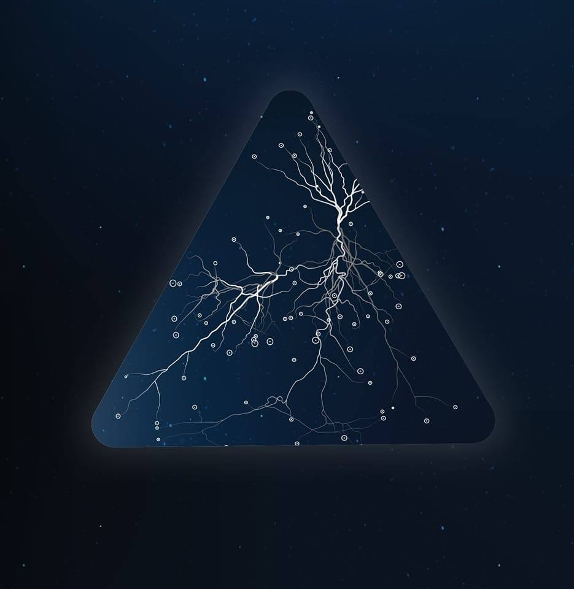

# ENSIAS AI Club 🤖

Welcome to the official GitHub repository of the ENSIAS AI Club! We are a community of AI enthusiasts at the National School of Computer Science and Systems Analysis (ENSIAS) in Morocco. Our mission is to promote and explore the fascinating world of Artificial Intelligence (AI) through collaborative projects, workshops, and knowledge sharing. 🚀

## About Us 📚
We are a group of Moroccan university students passionate about Artificial Intelligence (AI). Our club is dedicated to exploring the many possibilities of AI and its applications in a wide range of fields. We are committed to helping our members develop their knowledge and understanding of AI, as well as providing a platform for them to share their ideas and experiences. Our goal is to provide a safe and encouraging environment for our members to explore AI and gain practical experience in AI technologies. We look forward to creating a community of like-minded individuals who are eager to learn and share their insights.

At ENSIAS AI Club, we foster an inclusive and collaborative environment where members can:

- **Learn** 📖: We provide resources, tutorials, and workshops to help them grasp the fundamentals of AI and stay updated with the latest advancements.

- **Create** 🛠️: Join hands-on projects and develop AI solutions that tackle real-world problems. Put their knowledge into action and make a meaningful impact.

- **Connect** 🤝: Network with like-minded individuals, both within ENSIAS and beyond. We believe in the power of community and collaboration.

## What You'll Find in Our Repository 📂

This repository serves as a hub for our club's projects, resources, and activities. Here's what you can expect to find:

- **Projects** 🌟: Explore our AI projects, ranging from beginner-friendly to advanced. Feel free to contribute or use them as a learning resource.

- **Workshops** 🎓: Access materials from our workshops, including slides, code examples, and datasets.

- **Resources** 📦: Find AI-related articles, books, and online courses to aid your learning journey.

- **Events** 📅: Stay updated on our upcoming events, meetings, and hackathons.

## How to Get Involved ✨

Joining the ENSIAS AI Club is easy and open to all ENSIAS students who share our passion for AI. Here's how you can get involved:

1. **Join Our Community** 🌐: Follow us on GitHub to receive updates on our projects and activities.

2. **Attend Our Events** 📣: Keep an eye on our event announcements and join us for workshops and meetups.

3. **Contribute** 🙌: Feel free to contribute to our projects or start your own AI project within the club. We encourage collaboration and knowledge sharing.

4. **Spread the Word** 📢: Help us grow by sharing our club with your friends and colleagues who might be interested.

## Connect With Us 🌐

Stay connected with ENSIAS AI Club on our social media platforms and other communication channels:

- **GitHub**: [ENSIAS AI Club on GitHub](https://github.com/ensias-ai-club)
- **Facebook**: [ENSIAS AI Club on Facebook](https://www.facebook.com/ensiasai)
- **LinkedIn**: [ENSIAS AI Club on LinkedIn](https://www.linkedin.com/company/ensiasai/)
- **Email**: [ensias.ai.club@email.com](mailto:ensiais.ai.club@email.com)

We're excited to have you as part of our AI community at ENSIAS. Let's learn, create, and innovate together! 🤖🚀

